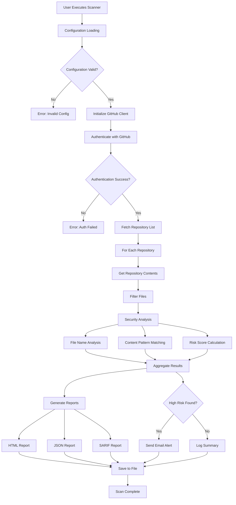

# GitScanner - Architecture & Design Patterns

## Advanced Data Flow Diagrams

### Complete System Data Flow



### Enhanced Security Analysis Pipeline

```
┌─────────────────────────────────────────────────────────────────────────────┐
│                         Security Analysis Pipeline                          │
└─────────────────────────────────────────────────────────────────────────────┘

Input File
    │
    ▼
┌─────────────────┐
│ Pre-Processing  │
│ • Size Check    │
│ • Binary Detect │
│ • Encoding Det. │
└─────────────────┘
    │
    ▼
┌─────────────────┐    ┌─────────────────┐    ┌─────────────────┐
│ Layer 1:        │    │ Layer 2:        │    │ Layer 3:        │
│ File Analysis   │    │ Content         │    │ Context         │
│                 │    │ Analysis        │    │ Analysis        │
│ • Name Patterns │    │ • Regex Patterns│    │ • Entropy       │
│ • Extension     │    │ • String Match  │    │ • Surrounding   │
│ • Path Location │    │ • Format Valid  │    │   Text          │
│ • File Size     │    │ • Checksum      │    │ • File Type     │
└─────────────────┘    └─────────────────┘    └─────────────────┘
    │                          │                          │
    ▼                          ▼                          ▼
┌─────────────────┐    ┌─────────────────┐    ┌─────────────────┐
│ Score: 0-30     │    │ Score: 0-50     │    │ Score: 0-20     │
│ Confidence: Low │    │ Confidence: Med │    │ Confidence: Var │
└─────────────────┘    └─────────────────┘    └─────────────────┘
    │                          │                          │
    └──────────────────────────┼──────────────────────────┘
                               ▼
                    ┌─────────────────┐
                    │ Risk Aggregator │
                    │ • Weighted Sum  │
                    │ • Normalization │
                    │ • Thresholding  │
                    └─────────────────┘
                               │
                               ▼
                    ┌─────────────────┐
                    │ Final Risk      │
                    │ • Score (0-100) │
                    │ • Level (L/M/H/C│
                    │ • Confidence    │
                    │ • Reasoning     │
                    └─────────────────┘
```

### Multi-Engine Architecture Comparison

```
┌─────────────────────────────────────────────────────────────────────────────┐
│                         Scanning Engine Comparison                          │
├─────────────────────────────────────────────────────────────────────────────┤
│  Feature                │ Simple    │ Enhanced  │ Enterprise │ Use Case    │
├─────────────────────────┼───────────┼───────────┼────────────┼─────────────┤
│  File Name Analysis     │    ✓      │     ✓     │     ✓      │ All         │
│  Basic Pattern Match    │    ✓      │     ✓     │     ✓      │ All         │
│  HTML Report Gen        │    ✓      │     ✓     │     ✓      │ All         │
│  Email Notifications    │    ✓      │     ✓     │     ✓      │ All         │
├─────────────────────────┼───────────┼───────────┼────────────┼─────────────┤
│  MIME Type Detection    │    ✗      │     ✓     │     ✓      │ Production  │
│  Content Analysis       │    ✗      │     ✓     │     ✓      │ Production  │
│  Entropy Analysis       │    ✗      │     ✓     │     ✓      │ Security    │
│  Performance Optimiz.   │    ✗      │     ✓     │     ✓      │ Large Scale │
├─────────────────────────┼───────────┼───────────┼────────────┼─────────────┤
│  Git History Scanning   │    ✗      │     ✗     │     ✓      │ Compliance  │
│  Advanced Regex Rules   │    ✗      │     ✗     │     ✓      │ Enterprise  │
│  SARIF Output          │    ✗      │     ✗     │     ✓      │ CI/CD       │
│  Custom Rule Engine     │    ✗      │     ✗     │     ✓      │ Enterprise  │
│  Risk Scoring Engine    │    ✗      │     ✗     │     ✓      │ Enterprise  │
└─────────────────────────┴───────────┴───────────┴────────────┴─────────────┘

Performance Characteristics:
┌─────────────────────────────────────────────────────────────────────────────┐
│ Engine      │ Startup │ Memory  │ CPU Usage │ Accuracy │ False Positives  │
├─────────────┼─────────┼─────────┼───────────┼──────────┼──────────────────┤
│ Simple      │ Fast    │ Low     │ Low       │ Basic    │ Medium           │
│ Enhanced    │ Medium  │ Medium  │ Medium    │ Good     │ Low              │
│ Enterprise  │ Slow    │ High    │ High      │ Excellent│ Very Low         │
└─────────────┴─────────┴─────────┴───────────┴──────────┴──────────────────┘
```

## Design Patterns & Principles

### 1. Strategy Pattern - Multiple Scanning Engines

```python
from abc import ABC, abstractmethod

class ScanningStrategy(ABC):
    @abstractmethod
    def scan_repository(self, repo_data: dict) -> dict:
        pass
    
    @abstractmethod
    def analyze_file(self, file_path: str, content: str) -> dict:
        pass

class SimpleScanningStrategy(ScanningStrategy):
    def scan_repository(self, repo_data: dict) -> dict:
        # Basic filename-based scanning
        return self._basic_analysis(repo_data)
    
    def analyze_file(self, file_path: str, content: str) -> dict:
        # Simple pattern matching
        return self._filename_analysis(file_path)

class EnhancedScanningStrategy(ScanningStrategy):
    def scan_repository(self, repo_data: dict) -> dict:
        # Advanced content and entropy analysis
        return self._enhanced_analysis(repo_data)
    
    def analyze_file(self, file_path: str, content: str) -> dict:
        # Content analysis + MIME detection
        return self._content_analysis(file_path, content)

class EnterpriseScanningStrategy(ScanningStrategy):
    def scan_repository(self, repo_data: dict) -> dict:
        # Full enterprise analysis with git history
        return self._enterprise_analysis(repo_data)
    
    def analyze_file(self, file_path: str, content: str) -> dict:
        # Advanced regex + risk scoring + SARIF
        return self._enterprise_file_analysis(file_path, content)
```

### 2. Observer Pattern - Notification System

```python
from typing import List, Protocol

class SecurityObserver(Protocol):
    def notify(self, event: SecurityEvent) -> None: ...

class SecurityEvent:
    def __init__(self, event_type: str, severity: str, data: dict):
        self.event_type = event_type
        self.severity = severity
        self.data = data
        self.timestamp = datetime.now()

class SecurityNotificationManager:
    def __init__(self):
        self._observers: List[SecurityObserver] = []
    
    def add_observer(self, observer: SecurityObserver) -> None:
        self._observers.append(observer)
    
    def notify_observers(self, event: SecurityEvent) -> None:
        for observer in self._observers:
            observer.notify(event)

class EmailNotificationObserver:
    def notify(self, event: SecurityEvent) -> None:
        if event.severity in ['HIGH', 'CRITICAL']:
            self.send_immediate_alert(event)

class LoggingObserver:
    def notify(self, event: SecurityEvent) -> None:
        logger.log(event.severity, f"{event.event_type}: {event.data}")

class MetricsObserver:
    def notify(self, event: SecurityEvent) -> None:
        self.update_security_metrics(event)
```

### 3. Factory Pattern - Report Generation

```python
from abc import ABC, abstractmethod
from enum import Enum

class ReportFormat(Enum):
    HTML = "html"
    JSON = "json"
    SARIF = "sarif"
    CSV = "csv"

class ReportGenerator(ABC):
    @abstractmethod
    def generate(self, scan_results: dict) -> str:
        pass

class HTMLReportGenerator(ReportGenerator):
    def generate(self, scan_results: dict) -> str:
        return self._render_html_template(scan_results)

class JSONReportGenerator(ReportGenerator):
    def generate(self, scan_results: dict) -> str:
        return json.dumps(scan_results, indent=2)

class SARIFReportGenerator(ReportGenerator):
    def generate(self, scan_results: dict) -> str:
        return self._convert_to_sarif_format(scan_results)

class ReportFactory:
    _generators = {
        ReportFormat.HTML: HTMLReportGenerator,
        ReportFormat.JSON: JSONReportGenerator,
        ReportFormat.SARIF: SARIFReportGenerator,
    }
    
    @classmethod
    def create_generator(cls, format_type: ReportFormat) -> ReportGenerator:
        generator_class = cls._generators.get(format_type)
        if not generator_class:
            raise ValueError(f"Unsupported report format: {format_type}")
        return generator_class()
```

### 4. Chain of Responsibility - Security Analysis

```python
from abc import ABC, abstractmethod
from typing import Optional

class SecurityAnalysisHandler(ABC):
    def __init__(self):
        self._next_handler: Optional[SecurityAnalysisHandler] = None
    
    def set_next(self, handler: 'SecurityAnalysisHandler') -> 'SecurityAnalysisHandler':
        self._next_handler = handler
        return handler
    
    @abstractmethod
    def handle(self, file_data: dict) -> dict:
        if self._next_handler:
            return self._next_handler.handle(file_data)
        return file_data

class FilenameAnalysisHandler(SecurityAnalysisHandler):
    def handle(self, file_data: dict) -> dict:
        # Analyze filename for suspicious patterns
        file_data['filename_risk'] = self._analyze_filename(file_data['path'])
        return super().handle(file_data)

class ContentAnalysisHandler(SecurityAnalysisHandler):
    def handle(self, file_data: dict) -> dict:
        # Analyze file content for secrets
        if file_data.get('content'):
            file_data['content_risks'] = self._analyze_content(file_data['content'])
        return super().handle(file_data)

class EntropyAnalysisHandler(SecurityAnalysisHandler):
    def handle(self, file_data: dict) -> dict:
        # Calculate entropy for potential secrets
        if file_data.get('content'):
            file_data['entropy_score'] = self._calculate_entropy(file_data['content'])
        return super().handle(file_data)

class RiskAggregationHandler(SecurityAnalysisHandler):
    def handle(self, file_data: dict) -> dict:
        # Aggregate all risk scores into final assessment
        file_data['final_risk'] = self._aggregate_risks(file_data)
        return file_data
```

## Advanced Configuration Schema

### Enterprise Configuration Structure

```yaml
# Advanced Configuration Schema (YAML)
scanner:
  version: "1.0"
  profile: "enterprise"  # simple, enhanced, enterprise
  
github:
  authentication:
    token: "${GITHUB_TOKEN}"
    username: "${GITHUB_USERNAME}"
  api:
    base_url: "https://api.github.com"
    timeout: 30
    retry_attempts: 3
    rate_limit:
      requests_per_hour: 4500
      delay_between_requests: 1.0

scanning:
  scope:
    include_private: true
    include_forks: false
    include_archived: false
    repository_filter: ".*"
  
  file_analysis:
    max_file_size: 10485760  # 10MB
    skip_binary: true
    encoding_detection: true
    mime_type_detection: true
  
  content_analysis:
    enable_entropy_analysis: true
    entropy_threshold: 4.5
    enable_pattern_matching: true
    enable_context_analysis: true
  
  git_history:
    enable_history_scan: true
    max_commits: 1000
    scan_deleted_files: true
    blob_cache_size: 100

security_rules:
  pattern_groups:
    credentials:
      enabled: true
      severity: "HIGH"
      patterns:
        - name: "AWS Access Key"
          regex: "\\bAKIA[0-9A-Z]{16}\\b"
          confidence: 0.95
        - name: "GitHub Token"
          regex: "\\bghp_[a-zA-Z0-9]{36}\\b"
          confidence: 0.98
    
    secrets:
      enabled: true
      severity: "CRITICAL"
      patterns:
        - name: "Private Key"
          regex: "-----BEGIN (RSA )?PRIVATE KEY-----"
          confidence: 1.0
        - name: "JWT Token"
          regex: "\\beyJ[a-zA-Z0-9_-]+\\.[a-zA-Z0-9_-]+\\.[a-zA-Z0-9_-]+\\b"
          confidence: 0.8

  risk_scoring:
    weights:
      pattern_match: 0.6
      entropy_score: 0.2
      context_analysis: 0.15
      file_location: 0.05
    
    thresholds:
      critical: 85
      high: 65
      medium: 35
      low: 0

reporting:
  formats:
    - type: "html"
      enabled: true
      template: "security_dashboard"
      include_charts: true
    - type: "json"
      enabled: true
      pretty_print: true
    - type: "sarif"
      enabled: true
      version: "2.1.0"
  
  content_redaction:
    enabled: true
    redaction_pattern: "****"
    preserve_context: 3

notifications:
  email:
    enabled: ${EMAIL_ENABLED:false}
    smtp:
      server: "${SMTP_SERVER}"
      port: ${SMTP_PORT:587}
      use_tls: true
    authentication:
      username: "${SENDER_EMAIL}"
      password: "${SENDER_PASSWORD}"
    recipients:
      - "${RECIPIENT_EMAILS}"
    
    triggers:
      critical: true
      high: true
      medium: false
      low: false
    
    templates:
      immediate_alert: "security_alert.html"
      summary_report: "security_summary.html"

logging:
  level: "${LOG_LEVEL:INFO}"
  file: "${LOG_FILE:github_monitor.log}"
  format: "%(asctime)s - %(name)s - %(levelname)s - %(message)s"
  rotation:
    max_size: "10MB"
    backup_count: 5

performance:
  concurrency:
    max_workers: 4
    repository_batch_size: 10
    file_batch_size: 100
  
  caching:
    enabled: true
    cache_directory: ".cache"
    cache_ttl: 3600  # 1 hour
  
  memory:
    max_memory_usage: "1GB"
    gc_threshold: 0.8
```

## Error Handling & Recovery Strategies

### Error Classification Matrix

```
┌─────────────────────────────────────────────────────────────────────────────┐
│                           Error Handling Matrix                             │
├─────────────────────────────────────────────────────────────────────────────┤
│ Error Type           │ Severity │ Recovery Strategy  │ User Action          │
├─────────────────────┼──────────┼───────────────────┼──────────────────────┤
│ Configuration       │ Critical │ Exit with error   │ Fix config, restart  │
│ Invalid GitHub Token│ Critical │ Exit with error   │ Update token         │
│ Network Timeout     │ Medium   │ Retry with delay  │ Check connectivity   │
│ Rate Limit Hit      │ Medium   │ Wait and retry    │ Reduce request rate  │
│ Repository Not Found│ Low      │ Skip and continue │ Check permissions    │
│ File Access Denied  │ Low      │ Skip and continue │ Check repo access    │
│ Memory Exhaustion   │ High     │ Reduce batch size │ Increase system RAM  │
│ Disk Space Full     │ High     │ Clean temp files  │ Free disk space      │
└─────────────────────┴──────────┴───────────────────┴──────────────────────┘
```

### Recovery Mechanisms

```python
class ErrorRecoveryManager:
    def __init__(self):
        self.retry_strategies = {
            'network_error': ExponentialBackoffStrategy(max_retries=3),
            'rate_limit': LinearBackoffStrategy(wait_time=60),
            'temporary_error': ImmediateRetryStrategy(max_retries=1)
        }
    
    async def execute_with_recovery(self, operation, error_type='network_error'):
        strategy = self.retry_strategies[error_type]
        
        for attempt in range(strategy.max_retries + 1):
            try:
                return await operation()
            except RetryableError as e:
                if attempt == strategy.max_retries:
                    raise
                await strategy.wait(attempt)
                logger.warning(f"Retry attempt {attempt + 1} for {operation.__name__}")
            except NonRetryableError as e:
                logger.error(f"Non-retryable error: {e}")
                raise
```

## Performance Optimization Techniques

### Memory Management Strategy

```python
class MemoryEfficientScanner:
    def __init__(self, max_memory_mb=1024):
        self.max_memory = max_memory_mb * 1024 * 1024
        self.current_memory = 0
        self.file_cache = {}
    
    def scan_repository_streaming(self, repo):
        """Stream-based scanning to reduce memory footprint"""
        for file_batch in self.get_files_in_batches(repo, batch_size=100):
            # Process batch
            results = self.process_file_batch(file_batch)
            
            # Check memory usage
            if self.get_memory_usage() > self.max_memory * 0.8:
                self.cleanup_cache()
                gc.collect()
            
            yield results
    
    def process_large_file(self, file_path, content):
        """Process large files in chunks"""
        chunk_size = 1024 * 1024  # 1MB chunks
        
        for i in range(0, len(content), chunk_size):
            chunk = content[i:i + chunk_size]
            chunk_results = self.analyze_content_chunk(chunk)
            yield chunk_results
```

### Parallel Processing Architecture

```python
import asyncio
import concurrent.futures
from typing import AsyncIterator

class ParallelScanningEngine:
    def __init__(self, max_workers=4):
        self.max_workers = max_workers
        self.thread_pool = concurrent.futures.ThreadPoolExecutor(max_workers=max_workers)
    
    async def scan_repositories_parallel(self, repositories):
        """Scan multiple repositories in parallel"""
        semaphore = asyncio.Semaphore(self.max_workers)
        
        async def scan_single_repo(repo):
            async with semaphore:
                return await self.scan_repository_async(repo)
        
        tasks = [scan_single_repo(repo) for repo in repositories]
        results = await asyncio.gather(*tasks, return_exceptions=True)
        
        return self.process_parallel_results(results)
    
    async def scan_repository_async(self, repository):
        """Asynchronous repository scanning"""
        loop = asyncio.get_event_loop()
        
        # Offload CPU-intensive work to thread pool
        return await loop.run_in_executor(
            self.thread_pool,
            self.scan_repository_sync,
            repository
        )
```

### Caching Strategy Implementation

```python
import hashlib
import pickle
from functools import wraps
from typing import Any, Callable

class CacheManager:
    def __init__(self, cache_dir=".cache", ttl=3600):
        self.cache_dir = Path(cache_dir)
        self.cache_dir.mkdir(exist_ok=True)
        self.ttl = ttl
    
    def cached_analysis(self, cache_key_func: Callable = None):
        """Decorator for caching analysis results"""
        def decorator(func):
            @wraps(func)
            def wrapper(*args, **kwargs):
                # Generate cache key
                if cache_key_func:
                    cache_key = cache_key_func(*args, **kwargs)
                else:
                    cache_key = self._generate_cache_key(func.__name__, args, kwargs)
                
                # Check cache
                cached_result = self._get_cached_result(cache_key)
                if cached_result is not None:
                    return cached_result
                
                # Execute function
                result = func(*args, **kwargs)
                
                # Cache result
                self._cache_result(cache_key, result)
                
                return result
            return wrapper
        return decorator
    
    def _generate_cache_key(self, func_name: str, args: tuple, kwargs: dict) -> str:
        """Generate unique cache key for function call"""
        key_data = f"{func_name}:{args}:{kwargs}"
        return hashlib.sha256(key_data.encode()).hexdigest()
    
    def _get_cached_result(self, cache_key: str) -> Any:
        """Retrieve cached result if valid"""
        cache_file = self.cache_dir / f"{cache_key}.pkl"
        
        if not cache_file.exists():
            return None
        
        # Check TTL
        if time.time() - cache_file.stat().st_mtime > self.ttl:
            cache_file.unlink()
            return None
        
        try:
            with open(cache_file, 'rb') as f:
                return pickle.load(f)
        except Exception:
            cache_file.unlink()
            return None
    
    def _cache_result(self, cache_key: str, result: Any) -> None:
        """Cache analysis result"""
        cache_file = self.cache_dir / f"{cache_key}.pkl"
        
        try:
            with open(cache_file, 'wb') as f:
                pickle.dump(result, f)
        except Exception as e:
            logger.warning(f"Failed to cache result: {e}")
```

---

This technical documentation provides comprehensive insights into the GitScanner architecture, design patterns, and implementation details. It serves as a reference for developers, security professionals, and system administrators working with the GitScanner security monitoring system.